<!-- TOC -->
- [供应商平台模型]()
    - [供应商注册页面](#供应商注册页面)
        - [用例图](#用例图)
        - [用例描述](#用例描述)
            - [用例一：导航到注册页面](#用例一：导航到注册页面)
            - [用例二：账号注册](#用例二：账号注册)
            - [用例三：填写基本信息](#用例三：填写基本信息)
            - [用例四：上传资料](#用例四：上传资料)
    - [供应商登录页面](#供应商登录页面)
        - [用例图](#用例图)
        - [用例描述](#用例描述)
            - [用例一：免费注册](#用例一：免费注册)
            - [用例二：忘记密码](#用例二：忘记密码)
            - [用例三：供应商登录](#用例三：供应商登录)
            - [用例四：点击验证码](#用例四：点击验证码)
            - [用例五：记住我](#用例四：记住我)
    - [首页](#首页)
        - [用例图](#用例图)
        - [用例描述](#用例描述)
            - [用例一：工作台](#用例一：工作台)
            - [用例二：个人中心](#用例二：个人中心)
            - [用例三：在线询价](#用例三：在线询价)
            - [用例四：查看更多](#用例四：查看更多)
            - [用例五：查看详情](#用例四：查看详情)
    - [在线询价](#在线询价)
        - [用例图](#用例图)
        - [用例描述](#)
            - [用例一：搜索询价](#用例一：搜索询价)
            - [用例二：查看详情](#用例二：查看详情)
            - [用例三：立即报价](#用例三：立即报价)

    - [工作台](#工作台)
        - [报价管理](#报价管理)
        - [合同管理](#合同管理)
        - [账号信息](#账号信息)
        - [企业资料](#企业资料)
        - [](#)
        - [](#)

## 供应商注册页面
### 用例图


```plantuml
left to right direction
actor 供应商    as a1

rectangle 供应商注册页面{
    usecase 导航到注册页面       as u1
    usecase 账号注册            as u2
    usecase 填写基本信息         as u3
    usecase 上传资料            as u4
    usecase 注册成功            as u5
    usecase 账号登录            as u6
}
a1 ---> u1:首次注册
a1 --[#lightyellow] u2
a1 --[#lightyellow] u3
a1 --[#lightyellow] u4
a1 --[#lightyellow] u5
a1 --> u6:注册成功
u1->u2
u2->u3
u3->u4
u4->u5
u5->u6
```
### 用例描述
#### 用例一：导航到注册页面
供应商在浏览器输入供应商网站首页的地址，点击右上角的注册按钮

#### 用例二：账号注册
在供应商进入注册页面之后，填写注册页面信息，进行注册
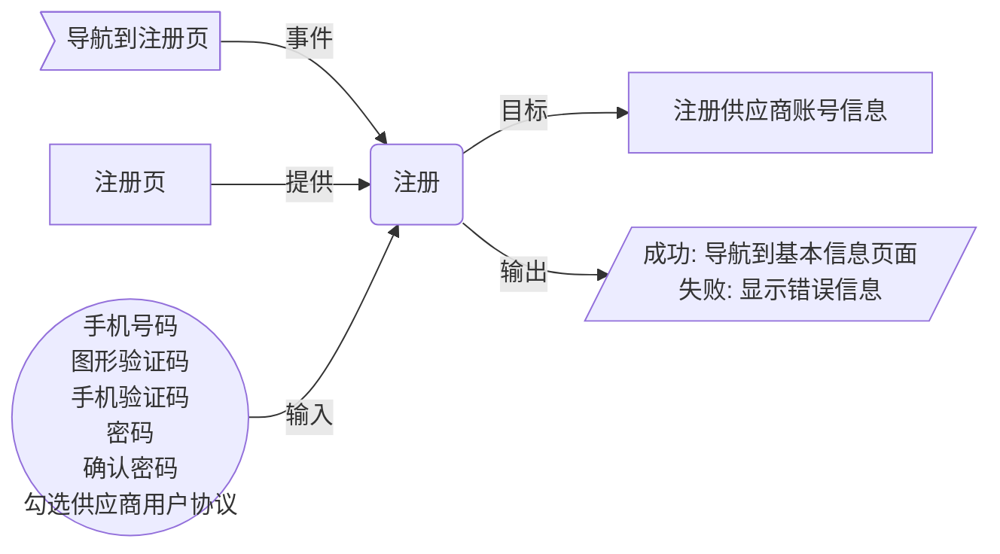

#### 用例三：填写基本信息
供应商注册后页面跳转到基本信息的填写，填写供应商公司的基本信息
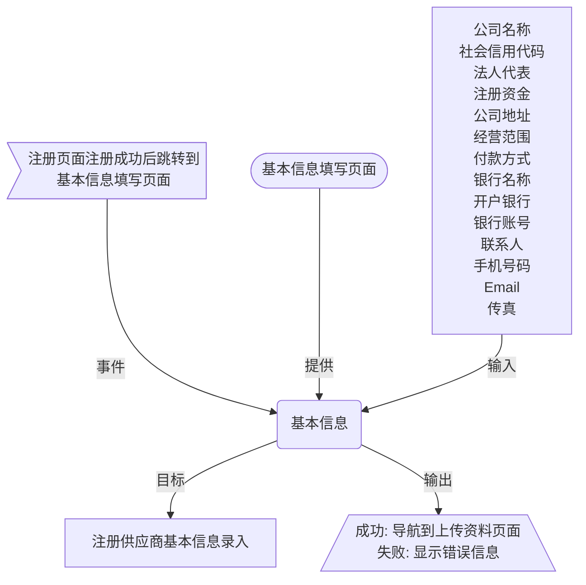

#### 用例四：上传资料
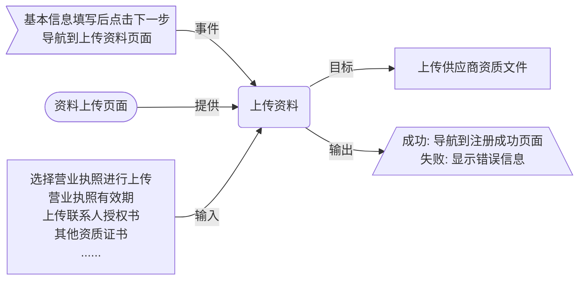
## 供应商登录页面
### 用例图
```plantuml
:供应商: as a

rectangle usecase{
    usecase 记住我 as u1
    usecase 点击验证码 as u2
    usecase 供应商登录 as u3
    usecase 忘记密码 as u4
    usecase 免费注册 as u5
}    
a-->u1
a-->u2
a-->u3
a-->u4
a-->u5
```
### 用例描述
#### 用例一：免费注册
若供应商是第一次进入供应商平台的登录页面，还没有注册过账号，可通过点击免费注册跳转至供应商注册页面进行注册。
#### 用例二：忘记密码
当注册过账号的供应商忘记密码，可通过点击忘记密码进行密码找回
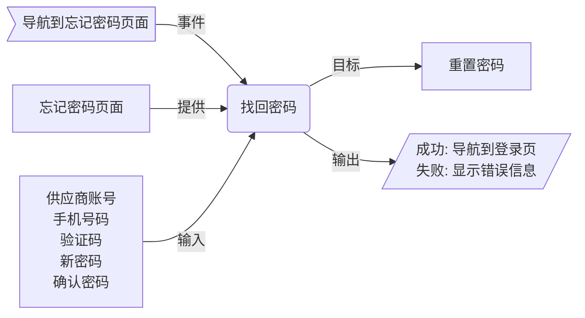
#### 用例三：供应商登录
供应商通过输入账号及密码进行登录
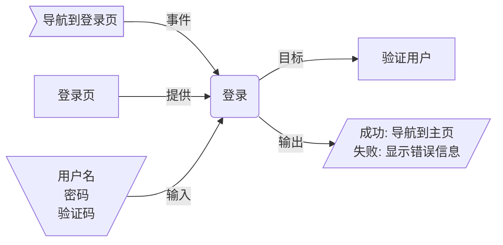

#### 用例四：点击验证码
供应商可通过点击验证码图片进行验证码的切换
#### 用例五：记住我
供应商在点击登录按钮之前，可以勾选“记住我”，以便在退出平台后再次登录时浏览器有缓存的账号信息，方便登录。
## 首页

### 用例图
```plantuml
left to right direction
actor 供应商
usecase 工作台
usecase 个人中心
usecase 在线询价
usecase 查看更多询价信息
usecase 查看询价详情
usecase 在线询价
usecase 资料下载
供应商 --> 工作台
供应商 --> 个人中心
供应商 --> 在线询价
供应商 --> 查看更多询价信息
供应商 --> 查看询价详情
供应商 --> 资料下载

```
### 用例描述
#### 用例一：工作台
供应商在首页中，点击右上角的工作台，便可进入工作台页面，可以查看、管理报价以及合同详情
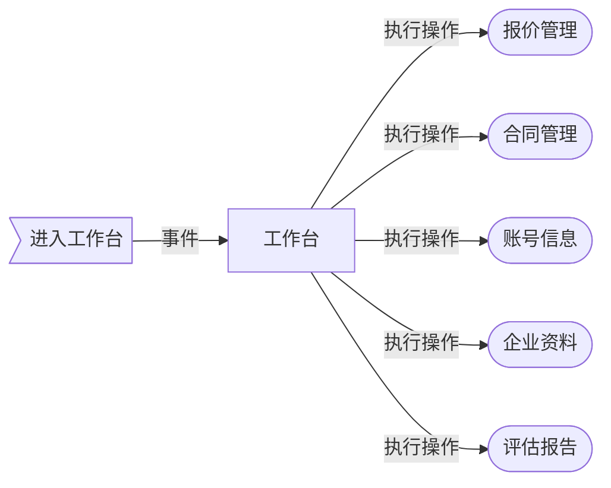
#### 用例二：个人中心（未完结）
供应商进入个人中心页面，可以进行一些个人账号的查看和修改操作

#### 用例三：在线询价
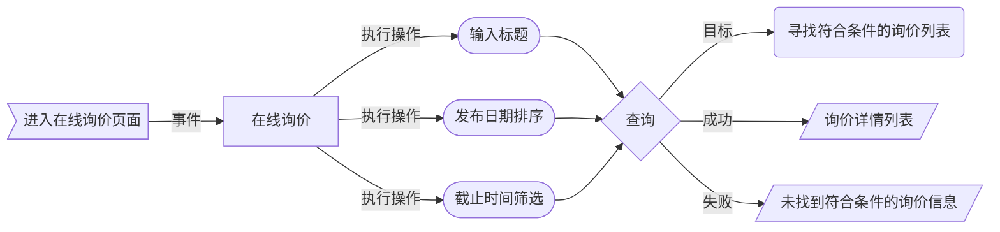
#### 用例四：查看更多
在首页的主页面下展开所有来自采购平台的询价信息
#### 用例四：查看详情

## 在线询价
### 用例图
```plantuml
actor 供应商 as u
(搜索询价) as a
(查看详情) as b
(立即报价) as c
u --> a
u --> b
u --> c
```
### 用例描述
#### 用例一：搜索询价
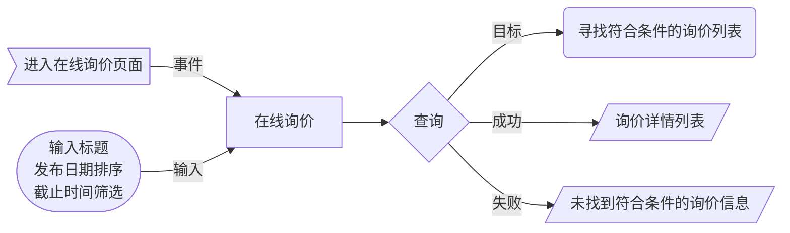
#### 用例二：查看详情
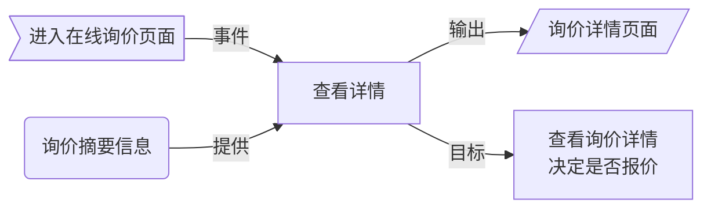
#### 用例三：立即报价
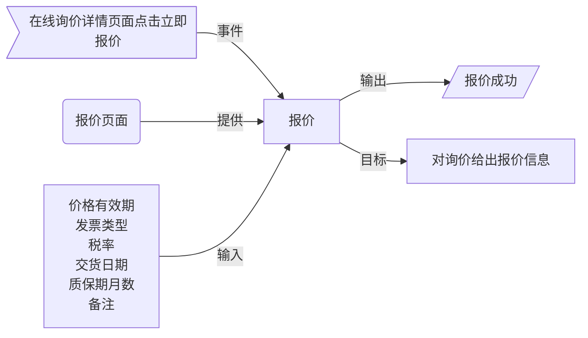
## 工作台
### 用例图
```plantuml
left to right direction
actor 供应商 as s
(待报价)    as q
(待确认合同) as c
(修改绑定手机)  as e
s --> q
s --> c
s --> e
```
### 用例描述
#### 用例一：待报价
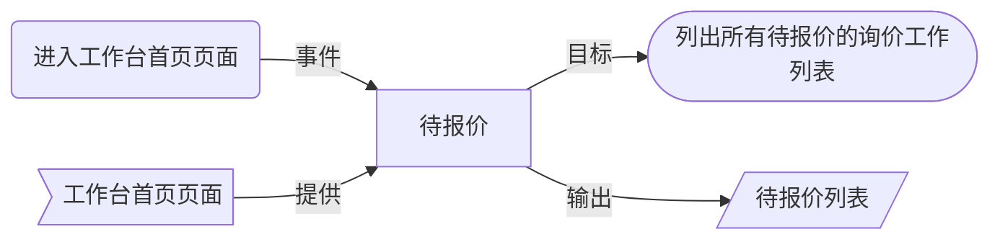
#### 用例二：待确认合同
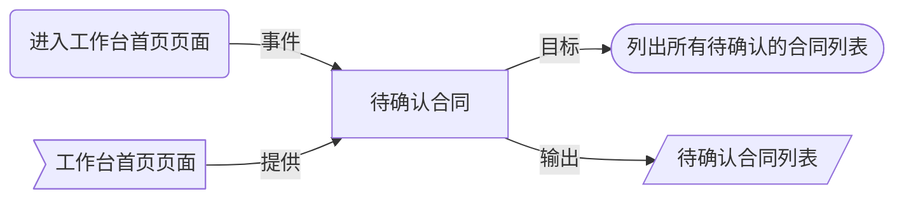
### 报价管理
### 合同管理
### 账号信息
### 企业资料


